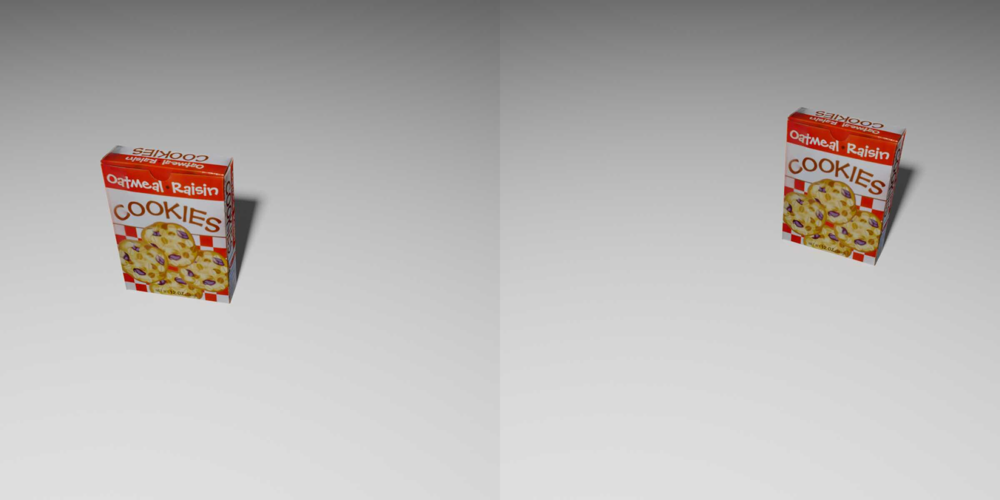
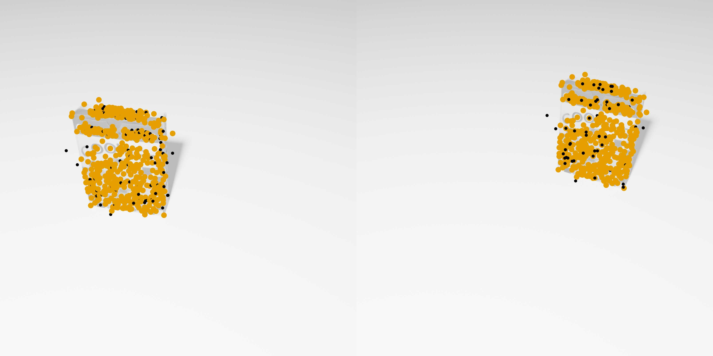
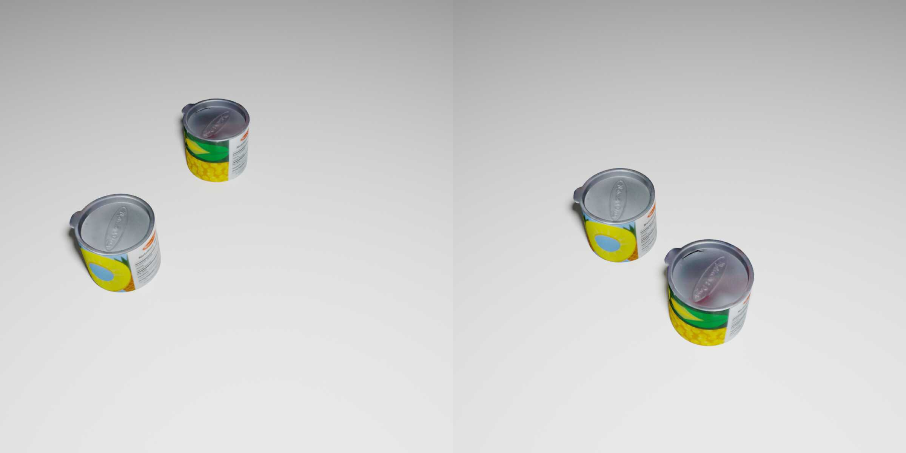
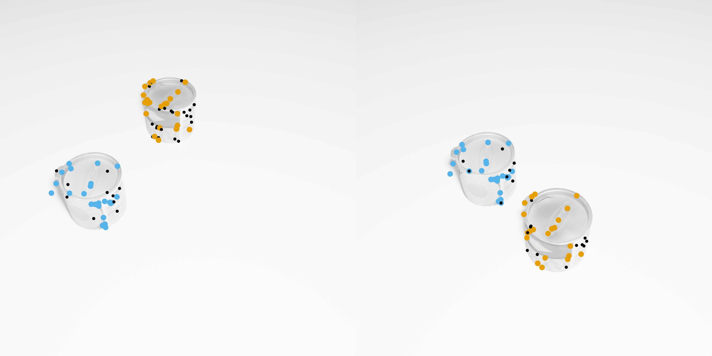
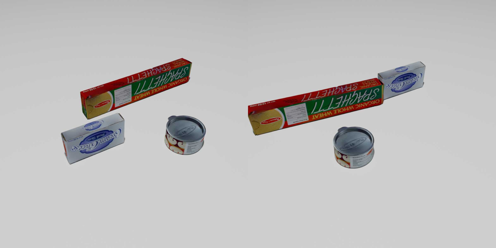
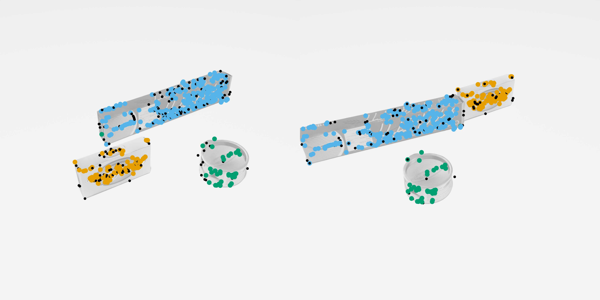
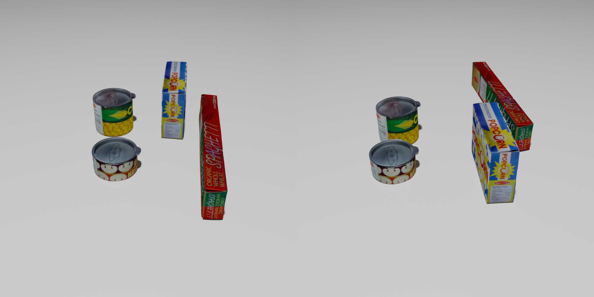
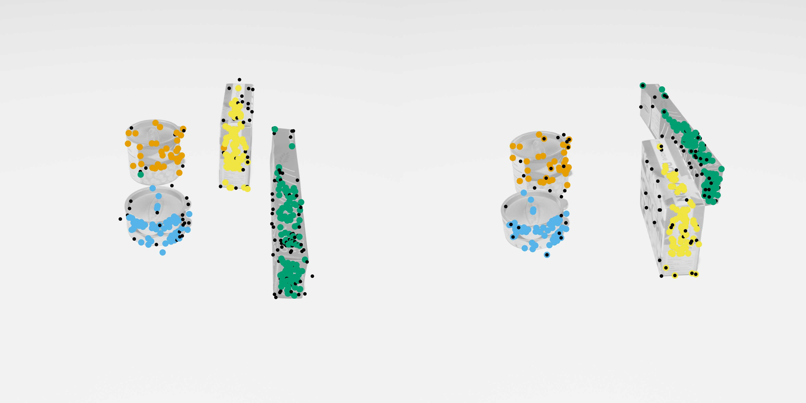

# HOPE-F Dataset for Multiple Fundamental Matrix Fitting
<p float="left">




</p>
<p float="left">




</p>

HOPE-F contains 4000 synthetically generated image pairs showing objects from the [HOPE Dataset](https://github.com/swtyree/hope-dataset).
Each pair shows between one and four objects moving independently between images.
We provide ground truth fundamental matrices for each object, as well as pre-computed SIFT features with ground truth cluster labels.

For more details about this dataset, please refer to our paper:  
[PARSAC: Accelerating Robust Multi-Model Fitting with Parallel Sample Consensus](https://arxiv.org/abs/2401.14919)

If you use this dataset in a publication, please cite our paper:
```
@inproceedings{kluger2024parsac,
  title={PARSAC: Accelerating Robust Multi-Model Fitting with Parallel Sample Consensus},
  author={Kluger, Florian and Rosenhahn, Bodo},
  booktitle={Proceedings of the AAAI Conference on Artificial Intelligence},
  year={2024}
}
```
as well as the original *HOPE-Image* paper:
```
@inproceedings{tyree2022hope,
  author={Tyree, Stephen and Tremblay, Jonathan and To, Thang and Cheng, Jia and Mosier, Terry and Smith, Jeffrey and Birchfield, Stan},
  title={6-DoF Pose Estimation of Household Objects for Robotic Manipulation: An Accessible Dataset and Benchmark},
  booktitle={International Conference on Intelligent Robots and Systems (IROS)},
  year={2022}
}
```
## Download

### Features and ground truth, no images (~61 MB)
https://cloud.tnt.uni-hannover.de/index.php/s/57fg3R4SqYarkWs

### Full dataset with RGB images (~8 GB) 
https://cloud.tnt.uni-hannover.de/index.php/s/SxcJTw62sZnLdp7

## Data structure
The dataset is split into four directories containing 1000 subdirectories each:
```
├── 1/
│   ├── 0000
│   ├── 0001
│   ├── ...
│   └── 0999
├── 2/
│   ├── 0000
│   ├── 0001
│   ├── ...
│   └── 0999
├── 3/
│   ├── 0000
│   ├── 0001
│   ├── ...
│   └── 0999
└── 4/
    ├── 0000
    ├── 0001
    ├── ...
    └── 0999
```
Every subdirectory contains one scene.
The name of each of the four parent directories indicates the number of objects per scene.

In each subdirectory, you can find the rendered images (if downloaded), pre-computed SIFT features and ground truth information. For example:
```
└── 3/
    └── 0123/
        ├── camera_parameters.npz
        ├── features_and_ground_truth.npz
        ├── object_0.npz
        ├── object_1.npz
        ├── object_2.npz
        ├── render0.png
        └── render1.png
```
* `features_and_ground_truth.npz`: Contains SIFT features (`points1`, `points2` and `ratios`), fundamental matrices (`F`) and cluster labels for the SIFT features (`labels`).
* `render0.png` and `render1.png`: RGB image pair
* `camera_parameters.npz`: intrinsic and extrinsic camera parameters
* `object_N.npz`: 3D object poses s

## Train/Val/Test Split
For our experiments, we split each parent directory (1-4) separately, using the following image pairs from each:
* Training: 0000-0799
* Validation: 0800-0899
* Test: 0900-0999

## Dataset generation
### Features and ground truth
We computed the SIFT features and ground truth with the script ```prepare_features_and_gt.py```. 
If you want to re-compute them, you can download our original rendered images with the required metadata [here](https://cloud.tnt.uni-hannover.de/index.php/s/TDktzrSgDafSmsT).

### Rendering
We rendered the images with Blender 3.4.1, using the script `blender_render.py` and the Blender Python API. 
You can download the meshes [here](https://cloud.tnt.uni-hannover.de/index.php/s/7ELsRyMr5JEEPmf). 
Since objects are randomised on the fly in the rendering script, the resulting images will be different from ours.

## License
Dataset: [CC BY-NC-SA 4.0](https://creativecommons.org/licenses/by-nc-sa/4.0)  
Source code: [BSD License](LICENSE)